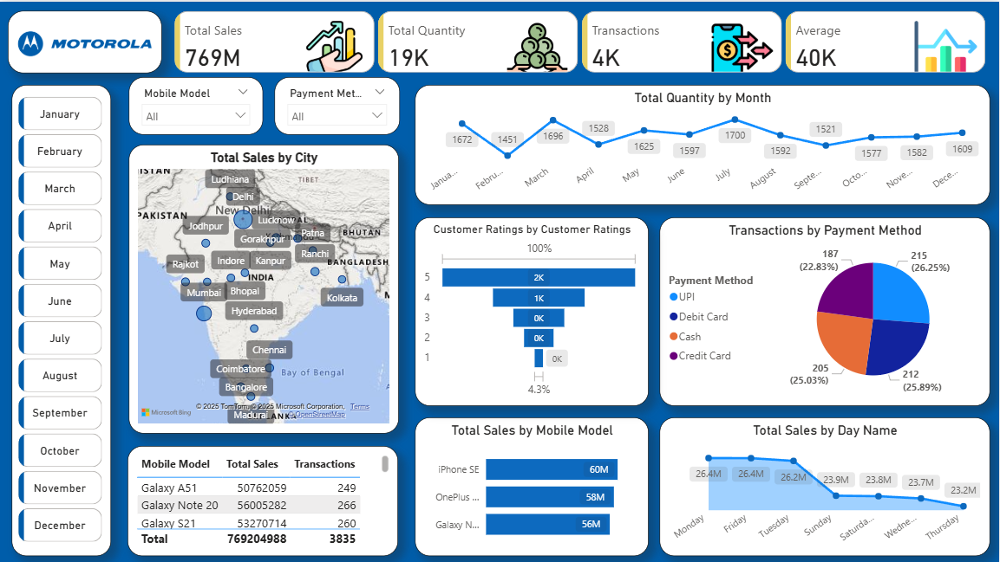

# 📊 Mobile Sales Dashboard – Power BI

This project features an interactive **Mobile Sales Analytics Dashboard** developed using **Microsoft Power BI**. It provides deep insights into revenue, customer behavior, payment methods, and product performance across multiple Indian cities.

---

## 🎯 Objective

To support data-driven decision-making by analyzing:

- 📌 Total sales performance & revenue growth
- 📈 Monthly product demand and seasonality trends
- 🏙 City-wise contribution to sales
- ⭐ Customer satisfaction and ratings distribution
- 💳 Shift in digital & offline payment methods
- 📱 Best-performing mobile models
- 📅 Day-wise purchase patterns

This dashboard enables better:
✔ Sales strategy planning  
✔ Inventory management  
✔ Customer experience improvement  
✔ Promotional campaign targeting  

---

## 📌 Key Performance Indicators (KPIs)

| KPI Title | Value | Description |
|---------|------|-------------|
| 💰 Total Sales | **769M** | Total revenue generated |
| 📦 Total Quantity Sold | **19K Units** | Overall product demand |
| 🛒 Total Transactions | **4K** | Number of sales operations |
| 📊 Average Monthly Sales | **40K** | Sales performance indicator |

---

## 📷 Dashboard Preview

---

## 📉 Business Insights From Dashboard

| Area | Key Insights |
|------|--------------|
| City Sales | Bengaluru, Delhi & Mumbai lead in revenue |
| Product Performance | High-end models like iPhone SE outperform others |
| Customer Ratings | Majority ratings are 4⭐ & 5⭐ → positive satisfaction |
| Payment Trend | UPI emerging as top mode (~26%) |
| Monthly Trend | Sales peak seen around **August** |
| Weekday Trend | Thursdays & Fridays show higher purchases |

---

## 🛠 Tools, Skills & Tech Used

| Category | Details |
|--------|---------|
| Tool | Microsoft Power BI Desktop |
| Data Source | CSV / Excel-based dataset |
| Data Processing | Power Query |
| Data Modeling | Star Schema, Relationships |
| Calculations | DAX Measures |
| Visuals Used | Map, Line Chart, Pie Chart, Bar Charts, KPIs |

---

